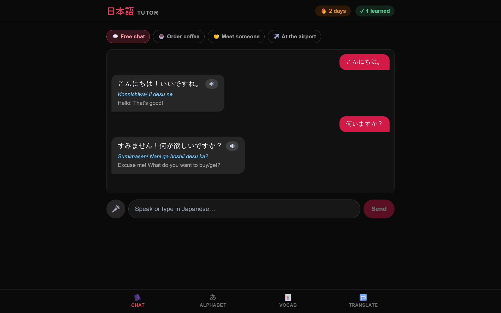

# 日本語 Tutor — a local-first Japanese learning app

A bold, single-page React app for learning Japanese as a beginner, powered entirely by a
**local LLM via [Ollama](https://ollama.com)** — no cloud API key, no data leaving your machine.

The AI runs through a tiny Express proxy, so the React frontend stays a clean single
component (`src/App.jsx`) that just calls `window.claude.complete(prompt)`.

## Screenshot

The **Chat** tab — speak or type in Japanese; the tutor replies in Japanese with romaji and
English, with role-play scenarios, a daily streak, and a words-learned counter.



## Features

Four tabs:

| Tab | What it does |
|-----|--------------|
| 🗣️ **Chat** | A speaking tutor. Talk in Japanese with the browser mic (Web Speech `SpeechRecognition`); the tutor replies out loud (text-to-speech) in Japanese with **romaji + English** underneath, puts your mistakes in a separate **correction box**, and offers role-play scenarios (order coffee, meet someone, at the airport). |
| 🔤 **Alphabet** | The full **hiragana & katakana** charts. Tap any character to hear it (TTS) and see an example word. |
| 🃏 **Vocab** | Preset flashcard decks (greetings, food, travel, numbers) **plus** a box where you type any topic and the model generates a 10-card deck on the spot. Flip cards, hear them, mark words as learned. |
| 🔁 **Translate** | Type English or Japanese — translates both directions, shows pronunciation, and breaks the sentence down **word-by-word with grammar notes**. |

Plus a **daily streak** and **words-learned** counter, both saved to `localStorage` so your
progress persists across sessions.

## Architecture

```
Browser (React + Tailwind)
        │  window.claude.complete(prompt)  ->  fetch('/api/complete')
        ▼
Vite dev server (:5173)  ──proxy /api──▶  Express proxy (:8787)
                                                │  POST /api/generate  (format: "json")
                                                ▼
                                          Ollama (:11434)  ──▶  local model (qwen2.5 / gemma3)
```

- **`src/App.jsx`** — the entire UI (unchanged from the original single-file artifact).
- **`src/main.jsx`** — defines the `window.claude.complete` shim that posts to the proxy.
- **`server/index.js`** — Express proxy that forwards prompts to Ollama and forces JSON output.

## Requirements

- [Node.js](https://nodejs.org) 18+
- [Ollama](https://ollama.com) installed and running
- A chat model pulled in Ollama, e.g.:
  ```bash
  ollama pull qwen2.5:7b      # best quality (≈4.7 GB)
  ollama pull qwen2.5:3b      # faster on CPU-only machines
  # gemma3 also works if you already have it
  ```

## Getting started

```bash
git clone git@github.com:<you>/nihongo-tutor.git
cd nihongo-tutor
npm install
cp .env.example .env          # then set OLLAMA_MODEL to a model you've pulled
npm run start                 # runs the proxy + Vite together
```

Open **http://localhost:5173**.

## Configuration (`.env`)

```ini
OLLAMA_URL=http://127.0.0.1:11434
OLLAMA_MODEL=qwen2.5:7b   # any chat model you've pulled (qwen2.5:3b, gemma3:latest, ...)
PORT=8787                 # proxy port (must match the proxy target in vite.config.js)
```

To switch models, change `OLLAMA_MODEL` and restart `npm run start`.

## Scripts

| Script | Does |
|--------|------|
| `npm run start` | Proxy **and** web together (recommended) |
| `npm run dev` | Vite frontend only |
| `npm run server` | Express proxy only |
| `npm run build` | Production build |

## Notes

- **Browser support:** microphone speech recognition works in **Chrome / Edge**, not Firefox.
- **Speed:** on a CPU-only machine the first AI request loads the model into RAM and can take
  ~30–60s; later requests are faster. The Alphabet tab and preset decks need no model and are instant.
- **Privacy:** everything runs locally. Nothing is sent to any third-party API.

## License

MIT
